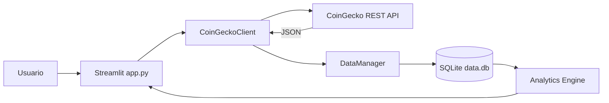

# DataViz Dynamics

Proyecto integrador de Python SSR que conecta una API REST de criptomonedas con una base de datos SQLite y un dashboard interactivo construido con Streamlit.

## Arquitectura



## Responsabilidades por módulo

- `services/data_fetcher.py`: conexión HTTP, timeout, retries, caché y rate limiting.
- `repositories/data_manager.py`: esquema, validación, transformación, consultas y persistencia.
- `services/analytics_engine.py`: KPIs, media móvil, volatilidad y rankings.
- `models/`: entidades desacopladas del JSON crudo.
- `app.py`: filtros, KPIs, gráficas, actualización y exportación CSV.
- `tests/`: pruebas unitarias.

## Requisitos

- Python 3.11 o superior.
- Acceso a terminal.
- API Key Demo gratuita de CoinGecko para actualizar datos reales.

## Instalación

### 1. Crear el entorno virtual

Windows PowerShell:

```powershell
py -m venv .venv
.\.venv\Scripts\Activate.ps1
```

macOS o Linux:

```bash
python3 -m venv .venv
source .venv/bin/activate
```

### 2. Instalar dependencias

```bash
python -m pip install --upgrade pip
pip install -r requirements.txt
```

### 3. Configurar variables de entorno

Copia `.env.example` como `.env`.

Windows PowerShell:

```powershell
Copy-Item .env.example .env
```

macOS o Linux:

```bash
cp .env.example .env
```

Después coloca tu API Key Demo:

```env
COINGECKO_API_KEY=tu_api_key_demo
```

### 4. Inicializar SQLite

No necesitas instalar ni levantar un servidor. Python incluye el módulo `sqlite3` y creará el archivo `data.db`.

```bash
python init_db.py --seed
```

El argumento `--seed` carga datos simulados para que el dashboard funcione incluso antes de consultar la API.

Para reiniciar completamente la base:

```bash
python init_db.py --reset --seed
```

### 5. Ejecutar el dashboard

```bash
python -m streamlit run app.py
```

Streamlit abrirá la aplicación en el navegador. Normalmente utiliza `http://localhost:8501`.

## Inspeccionar SQLite

Desde Python:

```bash
python inspect_db.py
```

Con la CLI de SQLite, si la tienes instalada:

```bash
sqlite3 data.db
.tables
.schema assets
SELECT * FROM assets;
SELECT * FROM price_history ORDER BY recorded_at DESC LIMIT 10;
.quit
```

También puedes abrir `data.db` desde una extensión visual de SQLite en VS Code.

## Ejecutar pruebas

```bash
pytest -q
```

## Esquema relacional

### `assets`

Catálogo único de criptomonedas.

### `price_history`

Snapshots históricos. Tiene una restricción única sobre `asset_id`, `recorded_at` y `currency`, por lo que una misma respuesta no se inserta dos veces.

### `sync_log`

Bitácora del resultado de cada sincronización.

## ¿Por qué SQLite y no CSV?

SQLite permite claves primarias, claves foráneas, restricciones de unicidad, transacciones y consultas indexadas. Estas propiedades protegen la integridad de los datos y evitan duplicados. Un CSV es adecuado para intercambio o exportación, pero no ofrece integridad referencial ni un motor de consultas transaccional.

## Reflexión crítica: límite de 10 llamadas por hora

La opción elegida es **B: implementar caché**, combinada con la persistencia existente en SQLite. Antes de consultar CoinGecko, el cliente verifica si existe una respuesta reciente. Si la caché sigue vigente, reutiliza esos datos; si expiró, realiza una nueva llamada y persiste el snapshot.

Esta decisión conserva el histórico, reduce latencia y evita contratar inmediatamente un servicio de pago. La duración de la caché debe alinearse con el caso de uso: 5 a 15 minutos para monitoreo frecuente o varias horas cuando el límite sea muy restrictivo. SQLite funciona además como respaldo cuando la API no está disponible.

## Campos principales del JSON

- `id`
- `symbol`
- `name`
- `current_price`
- `market_cap`
- `total_volume`
- `price_change_percentage_24h`
- `last_updated`

## Seguridad

- Las consultas usan parámetros SQL.
- La API Key se guarda en `.env`, archivo excluido de Git.
- La API Key se envía mediante header y no en la URL.
- Las respuestas se validan antes de persistirlas.
