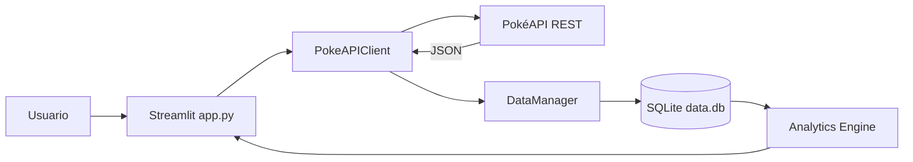

# PokéData Lab

Proyecto integrador de Python SSR que consume PokéAPI, valida y transforma su JSON, persiste información normalizada en SQLite y presenta un dashboard interactivo con Streamlit y Plotly.

## Arquitectura



## Estructura

```text
pokemon_dashboard/
├── app.py
├── init_db.py
├── inspect_db.py
├── requirements.txt
├── data.db
├── config/
├── models/
├── repositories/
├── services/
├── utils/
└── tests/
```

## Campos principales del JSON

- `id`: identificador único.
- `name`: nombre del Pokémon.
- `base_experience`: experiencia base.
- `height`: altura en decímetros.
- `weight`: peso en hectogramos.
- `types`: tipos y su orden.
- `stats`: HP, ataque, defensa, estadísticas especiales y velocidad.
- `abilities`: habilidades.
- `sprites`: imágenes disponibles.

El modelo `Pokemon` funciona como una capa anticorrupción: el resto de la aplicación no depende directamente del JSON crudo.

## Esquema SQLite

- `pokemon`: catálogo principal.
- `types`: catálogo de tipos.
- `pokemon_types`: relación muchos a muchos entre Pokémon y tipos.
- `pokemon_stats`: estadísticas normalizadas por Pokémon.
- `sync_log`: bitácora de sincronizaciones y errores.

## ¿Por qué SQLite y no CSV?

SQLite ofrece claves primarias, claves foráneas, restricciones, índices, transacciones y consultas relacionales. Esto garantiza integridad referencial entre Pokémon, tipos y estadísticas. Un CSV es útil para exportación, pero no evita duplicados ni protege relaciones entre entidades.

## Instalación

### 1. Crear entorno virtual

Windows PowerShell:

```powershell
py -m venv .venv
.\.venv\Scripts\Activate.ps1
```

macOS o Linux:

```bash
python3 -m venv .venv
source .venv/bin/activate
```

### 2. Instalar dependencias

```bash
python -m pip install --upgrade pip
pip install -r requirements.txt
```

### 3. Configuración opcional

PokéAPI no requiere API key. El archivo `.env` solo permite cambiar parámetros técnicos.

Windows:

```powershell
Copy-Item .env.example .env
```

macOS o Linux:

```bash
cp .env.example .env
```

### 4. Crear SQLite y cargar datos demo

SQLite no se levanta como servidor. Python crea el archivo `data.db` directamente.

```bash
python init_db.py --seed
```

Para reconstruir la base:

```bash
python init_db.py --reset --seed
```

### 5. Ejecutar la aplicación

```bash
python -m streamlit run app.py
```

Abre normalmente `http://localhost:8501`.

### 6. Inspeccionar la base

```bash
python inspect_db.py
```

### 7. Ejecutar pruebas

```bash
pytest -q
```

## Funcionalidades

- Actualización desde PokéAPI sin token.
- Caché temporal y reintentos HTTP.
- Persistencia normalizada en SQLite.
- Validación del contrato JSON.
- Filtros por tipo y generación.
- KPIs generales y por Pokémon.
- Ranking por distintas métricas.
- Gráfico radar de estadísticas.
- Dispersión de altura, peso y poder.
- Distribución por tipo.
- Exportación CSV.
- Estado vacío y datos demo offline.

## Reflexión crítica: límite de 10 llamadas por hora

Elegiría la opción **B: caché**, combinada con SQLite. La aplicación consulta primero una caché temporal. Si todavía está vigente, reutiliza los datos; si expiró, solicita información nueva y actualiza la base. SQLite conserva el último estado funcional aunque la API falle.

El beneficio es reducir latencia y llamadas externas sin perder información ni contratar inmediatamente un servicio de pago. La complejidad es moderada porque el cliente ya encapsula el TTL y el dashboard no conoce los detalles de la caché. Si el límite fuera extremadamente bajo, aumentaría `API_CACHE_TTL_SECONDS` y permitiría sincronizaciones manuales controladas.

## Decisiones de diseño

- `PokeAPIClient` concentra HTTP, timeout, reintentos y caché.
- `Pokemon.from_api()` valida y transforma el contrato externo.
- `DataManager` usa consultas parametrizadas y transacciones.
- `analytics_engine.py` no conoce detalles HTTP ni SQL.
- `app.py` se limita a orquestar interacción y visualización.

Los datos demo reproducen la estructura de PokéAPI para que el evaluador pueda ejecutar la aplicación sin conexión inicial.
