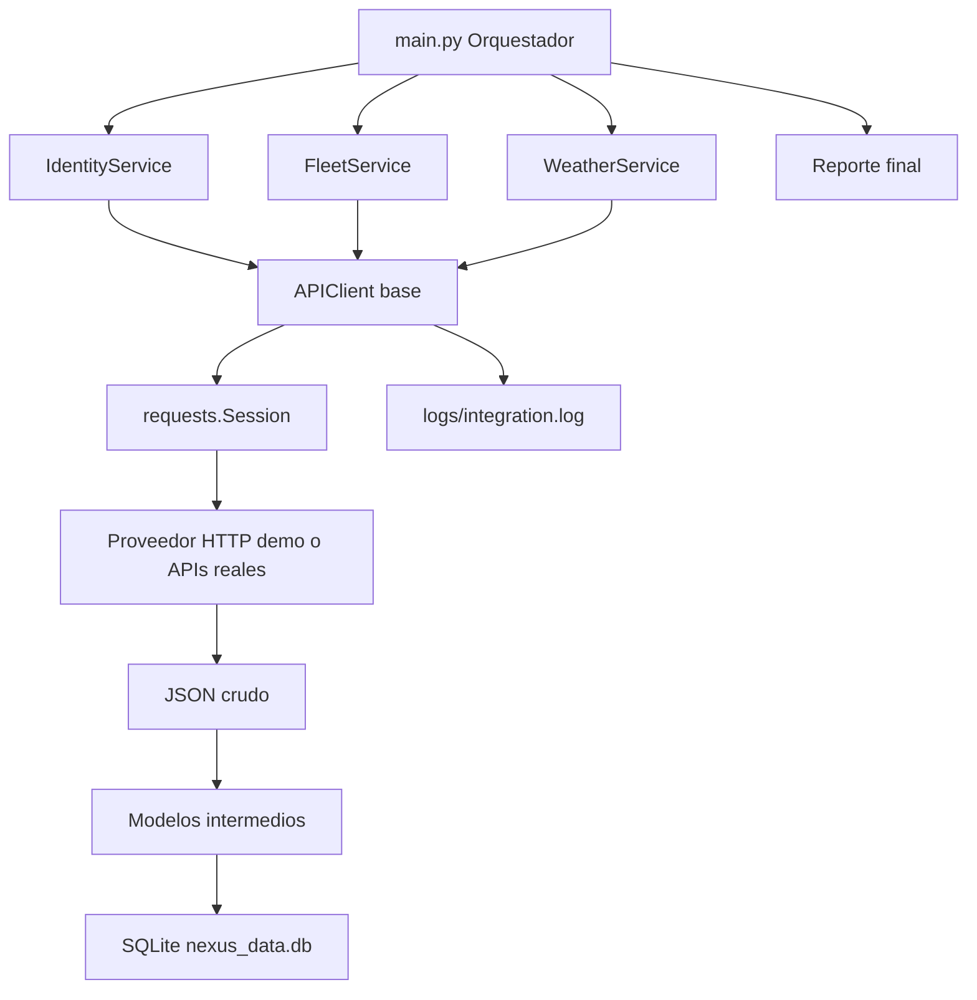

# Operación Puente de Datos

Proyecto de integración resiliente en Python para **Nexus Logistics**.

Este entregable implementa una arquitectura modular con:

- `requests.Session`
- retries con backoff exponencial y jitter
- caché local con TTL
- logging estructurado
- excepciones personalizadas
- modelos intermedios con `dataclasses`
- persistencia SQLite
- pruebas unitarias con mocks
- modo caos mediante `CHAOS_MODE=true`

## Estructura

```text
nexus_integration/
├── api_client.py
├── config.py
├── database.py
├── exceptions.py
├── inspect_db.py
├── main.py
├── models.py
├── requirements.txt
├── .env.example
├── INFORME_TECNICO.md
├── README.md
├── services/
│   ├── demo_provider.py
│   ├── fleet_service.py
│   ├── identity_service.py
│   └── weather_service.py
└── tests/
    ├── test_api_client.py
    ├── test_models.py
    └── test_services_and_database.py
```

## Diagrama de flujo



## Requisitos

- Python 3.11 o superior
- Terminal

## Instalación

### Windows PowerShell

```powershell
py -m venv .venv
.\.venv\Scripts\Activate.ps1
python -m pip install --upgrade pip
pip install -r requirements.txt
Copy-Item .env.example .env
```

### macOS o Linux

```bash
python3 -m venv .venv
source .venv/bin/activate
python -m pip install --upgrade pip
pip install -r requirements.txt
cp .env.example .env
```

## Ejecutar en modo normal

```bash
python main.py
```

Resultado esperado:

```text
Reporte final
Procesados: 9
Fallidos: 0
Omitidos por degradación: 0
Total evaluado: 9
```

La primera ejecución crea `nexus_data.db` automáticamente.

## Inspeccionar SQLite

```bash
python inspect_db.py
```

Salida esperada aproximada:

```text
Base: nexus_data.db
- drivers: 3 registros
- vehicle_positions: 3 registros
- weather_snapshots: 3 registros
- sync_runs: 1 registros
```

## Ejecutar modo caos

### Windows PowerShell

```powershell
$env:CHAOS_MODE="true"
python main.py
```

### macOS o Linux

```bash
CHAOS_MODE=true python main.py
```

En este modo el proveedor demo introduce errores `500`, `429` y retardos. El sistema debe registrar el problema, aplicar retries y continuar con degradación elegante cuando corresponda.

## Ejecutar pruebas

```bash
pytest -q
```

## Variables de entorno principales

| Variable | Descripción |
|---|---|
| `DEMO_PROVIDER_ENABLED` | Activa proveedor HTTP local sin APIs pagadas |
| `CHAOS_MODE` | Activa fallos aleatorios para pruebas de resiliencia |
| `WEATHER_BASE_URL` | URL real de proveedor de clima si se desactiva demo |
| `FLEET_BASE_URL` | URL real de rastreo si se desactiva demo |
| `IDENTITY_BASE_URL` | URL real de identidad si se desactiva demo |
| `WEATHER_API_KEY` | API key de clima, leída desde `.env` |
| `FLEET_BEARER_TOKEN` | Bearer token de flota, leído desde `.env` |
| `IDENTITY_API_KEY` | API key de identidad, leída desde `.env` |
| `MAX_RETRIES` | Reintentos máximos por request |
| `BACKOFF_FACTOR` | Factor base del backoff exponencial |
| `JITTER_SECONDS` | Aleatoriedad añadida al retry |
| `CACHE_TTL_SECONDS` | TTL general de caché |
| `RATE_LIMIT_PER_MINUTE` | Límite local de peticiones por minuto |

## Ejemplo de uso de `APIClient`

```python
from api_client import APIClient

client = APIClient(
    base_url="https://provider.example.com",
    service_name="example",
    max_retries=3,
    backoff_factor=0.5,
)

payload = client.get("/resource", use_cache=True, cache_ttl_seconds=300)
```

## Equivalencia con tu experiencia Spring Boot

| Python | Spring Boot |
|---|---|
| `APIClient` | Cliente HTTP base / interceptor / Feign config |
| `IdentityService`, `FleetService`, `WeatherService` | Services / adapters externos |
| `models.py` | DTOs internos / mappers |
| `exceptions.py` | Excepciones de dominio e infraestructura |
| `database.py` | Repository |
| `main.py` | Orquestador / job / use case |
| `.env` | `application.properties` + variables de entorno |
| `pytest` | JUnit + Mockito |

## Decisión arquitectónica clave

El sistema no consume el JSON externo directamente en todo el código. Primero transforma cada respuesta a modelos intermedios. Esto reduce acoplamiento: si un proveedor cambia un campo, se modifica el adapter/modelo correspondiente, no toda la aplicación.

## Recomendación para video demo

Graba 3 partes:

1. `python main.py` en modo normal.
2. `CHAOS_MODE=true python main.py` mostrando retries y errores controlados.
3. `pytest -q` mostrando pruebas exitosas.

Después abre `logs/integration.log` y explica cómo los logs permiten diagnosticar si el problema fue red, rate limit, servidor o datos.
