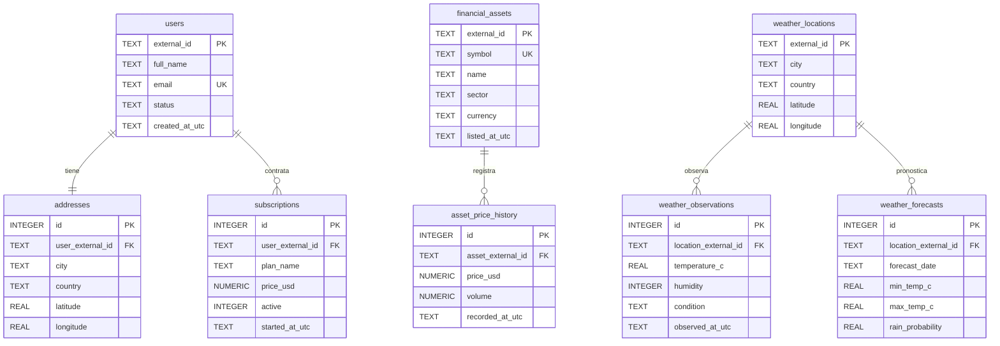

# Diagrama ERD - Global-Connect ETL



## Decisión de modelado

El JSON externo se recibe con campos anidados y listas internas. La base no guarda el JSON crudo como una sola columna porque eso dificultaría consultas analíticas. En su lugar, se normaliza en tablas relacionales con claves primarias, claves foráneas y restricciones de unicidad.

Ejemplo de anidación mapeada:

```text
data -> attributes -> history -> values[]
```

Se convierte en:

```text
financial_assets 1 ─── N asset_price_history
```
