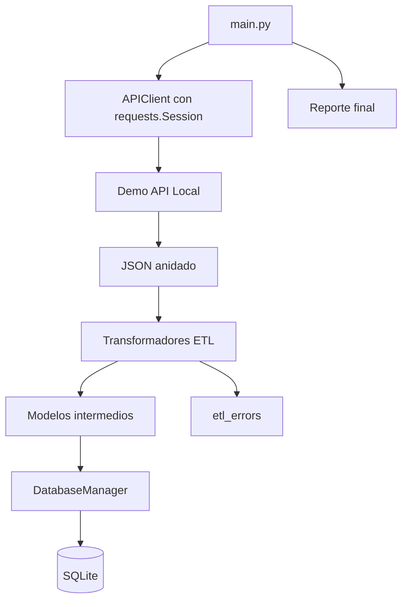

# The Data Architect Challenge: Construyendo el Nexo de Información

**Autor:** Josué Israel Vásquez Martínez  
**Proyecto:** Global-Connect ETL  
**Tecnología:** Python, requests, SQLite, pytest

## Descripción

Este proyecto implementa un flujo ETL completo para la startup ficticia **Global-Connect**. El sistema consume tres endpoints REST simulados:

1. Usuarios y suscripciones.
2. Activos financieros con historial de precios.
3. Datos meteorológicos por ciudad.

El objetivo es demostrar consumo de APIs REST con `requests`, transformación de JSON anidado, limpieza de datos, normalización relacional, inserciones masivas en SQLite, manejo de errores y reporte final de ejecución.

La API se simula localmente para que el proyecto pueda ejecutarse sin depender de plataformas pagadas ni API keys reales.

## Arquitectura



## Estructura

```text
global_connect_etl/
├── api_client.py
├── config.py
├── database.py
├── exceptions.py
├── export_csv.py
├── inspect_db.py
├── main.py
├── models.py
├── transformers.py
├── requirements.txt
├── .env.example
├── ERD.md
├── DATA_CONTRACT.md
├── DEV_LOG.md
├── services/
│   ├── demo_api_server.py
│   ├── finance_service.py
│   ├── identity_service.py
│   └── weather_service.py
└── tests/
    ├── test_api_client.py
    ├── test_database_and_main.py
    └── test_transformers.py
```

## Instalación

### Windows PowerShell

```powershell
py -m venv .venv
.\.venv\Scripts\Activate.ps1
python -m pip install --upgrade pip
pip install -r requirements.txt
Copy-Item .env.example .env
```

### macOS / Linux

```bash
python3 -m venv .venv
source .venv/bin/activate
python -m pip install --upgrade pip
pip install -r requirements.txt
cp .env.example .env
```

## Variables de entorno

```env
GLOBAL_CONNECT_BASE_URL=http://127.0.0.1:8765
USE_DEMO_SERVER=true
GLOBAL_CONNECT_BEARER_TOKEN=demo-token
GLOBAL_CONNECT_API_KEY=demo-api-key
DATABASE_NAME=global_connect.db
REQUEST_TIMEOUT_SECONDS=10
MAX_RETRIES=3
BACKOFF_BASE_SECONDS=0.20
CACHE_TTL_SECONDS=60
LOG_LEVEL=INFO
```

Las credenciales son simuladas. En producción se inyectarían desde el entorno, nunca hardcodeadas en el código.

## Ejecutar ETL

```bash
python main.py --reset-db --limit 50
```

Con `limit 50`, el proyecto procesa más de 100 registros normalizados porque cada activo financiero genera cinco registros históricos y cada ciudad genera tres pronósticos.

Salida esperada:

```text
Reporte final de ejecución
--------------------------------
Total procesados : 600
Total exitosos   : 600
Total fallidos   : 0
Tiempo total     : < 2 segundos
```

## Inspeccionar SQLite

```bash
python inspect_db.py
```

## Pruebas

```bash
pytest -q
```

Las pruebas cubren:

- Conversión de fecha ISO 8601.
- Rechazo de valores numéricos inválidos.
- Mapeo de JSON con tres niveles de anidación.
- Manejo de registros corruptos sin romper el ETL.
- Retry en HTTP 500.
- No retry en HTTP 404.
- JSON inválido.
- Caché.
- Inserciones masivas con más de 100 registros.

## Simular JSON vacío

```bash
python main.py --reset-db --empty
```

El sistema no se rompe. Genera una corrida con cero registros de negocio y guarda el resumen en `etl_runs`.

## Simular fallos aleatorios

```bash
python main.py --reset-db --chaos
```

El proveedor demo puede responder 429, 500 o 503. `APIClient` reintenta con backoff exponencial y jitter.

## Decisiones técnicas

### ¿Por qué `requests.Session`?

`requests.Session` permite reutilizar conexiones TCP y compartir headers comunes. Esto reduce latencia frente a crear una conexión nueva por cada petición.

### ¿Por qué modelos intermedios?

El JSON externo puede cambiar. Los modelos intermedios protegen al resto del sistema. Si el proveedor cambia `temp_celsius` por `temperature_c`, solo se modifica el transformador de clima, no la base de datos ni el resto del ETL.

### ¿Por qué SQLite?

SQLite es suficiente para este ejercicio porque permite integridad referencial, restricciones `UNIQUE`, claves foráneas e índices sin requerir un servidor adicional. Para un ambiente empresarial de mayor concurrencia, PostgreSQL sería la evolución natural.

### ¿Por qué bulk inserts?

El ejercicio exige eficiencia. Por eso se usa `executemany()` en lugar de insertar fila por fila. Esto mejora el rendimiento cuando el volumen supera 100 registros.

## Catálogo de errores personalizados

| Excepción | Significado |
|---|---|
| `IntegrationError` | Error base de integración |
| `APIConnectionError` | No fue posible comunicarse con la API |
| `APIRateLimitExceeded` | El proveedor respondió límite de peticiones |
| `APIResponseError` | Error HTTP no recuperable, por ejemplo 400 o 404 |
| `InvalidResponseFormat` | La respuesta no es JSON válido o no cumple la estructura esperada |
| `DataValidationError` | Un registro no cumple el contrato interno de datos |

## Resultado esperado con 50 registros

El ETL debe generar aproximadamente:

- 50 usuarios.
- 50 direcciones.
- 50 suscripciones.
- 50 activos financieros.
- 250 registros históricos de precio.
- 50 ubicaciones climáticas.
- 50 observaciones climáticas.
- 150 pronósticos.

Total de datos de negocio: **700 registros normalizados**.

## Comentarios del código

Los comentarios y docstrings del código están escritos en español para cumplir la indicación del ejercicio.

## Exportación CSV adicional

Como funcionalidad extra, el proyecto incluye exportación a CSV:

```bash
python export_csv.py
```

Los archivos se generan en la carpeta `exports/`.
